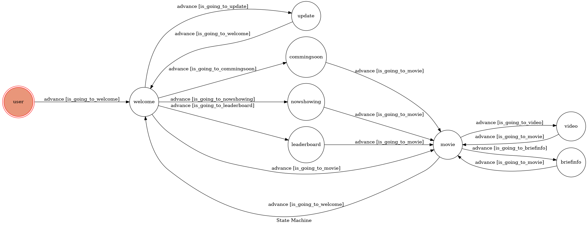

# README
###### tags: `linebot`

## linebot 主題
以威秀影城官網("https://www.vscinemas.com.tw/vsweb/index.aspx")做為爬蟲資料來源，讓使用者可以快速瀏覽電影資訊

## 功能介紹
1. 更新資料 &rarr; 將即將上映或正在熱映的電影資訊存下來
2. 即將上映 &rarr; 展示即將上映的電影(10個)
3. 熱映電影 &rarr; 展示現正熱映的電影(10個)
4. 排行榜 &rarr; 展示排行前五的電影 
5. 輸入電影名稱 &rarr; 展示電影資訊(演員名單、電影名稱等等)
6. 預告片 &rarr; 展示影片連結
7. 劇情簡介 &rarr; 展示劇情簡介

## 運用技術
1. python 
2. web crawler
3. linechatbot.api
4. Heroku (deploy)
5. multi-user(linebot)

## fsm graph

## Reference
FlexMessage : https://developers.line.biz/flex-simulator/?fbclid=IwAR12Kg6UNiFzwIAAMaorkv3FvuqUJEOmIQe0ciMPX19xUyF_ReJH8fHsHFY

Multi-user : https://l.facebook.com/l.php?u=https%3A%2F%2Fgithub.com%2Flofoz%2FLineBot%3Ffbclid%3DIwAR0tBCD0Vb136GL7YgzEUeRGYCGkjPWLlNmIG7B2wo5JHi2KLEN8AFHnU9k&h=AT0KHdJL3F_VrHmFGWbjTwE4dJVlwY1sT-gVk1Em9gxo5-TszWSMtyV5and10npu2pTnCMqfGKOj4TMKdRNdgRS3WstlmAdboOc8EY1nnmhBFbWPTTEQ0ecHHlRZ8X02qdqMaz_5Z60Iy94

Heroku deployment : https://www.codenong.com/94e124b895399dea9c7d/
